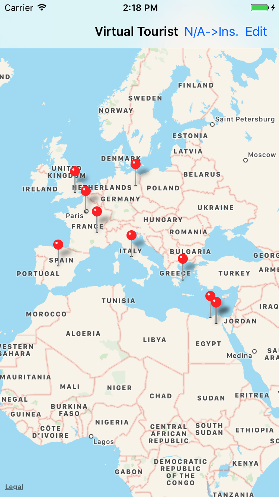
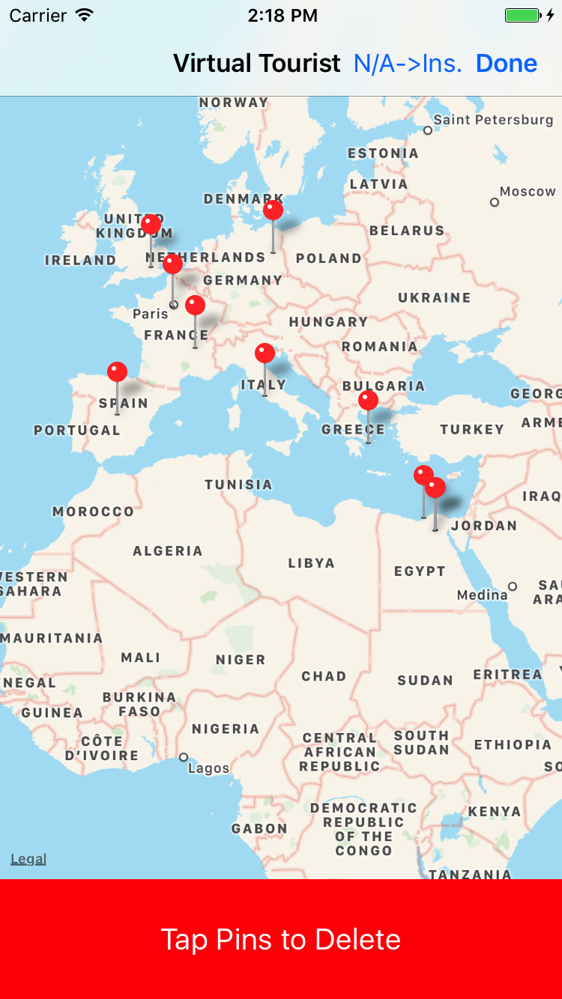
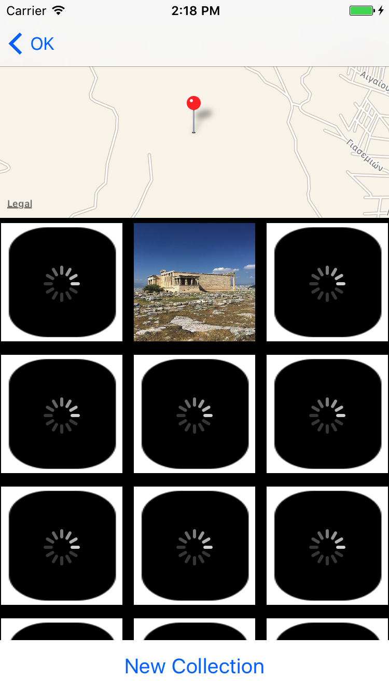
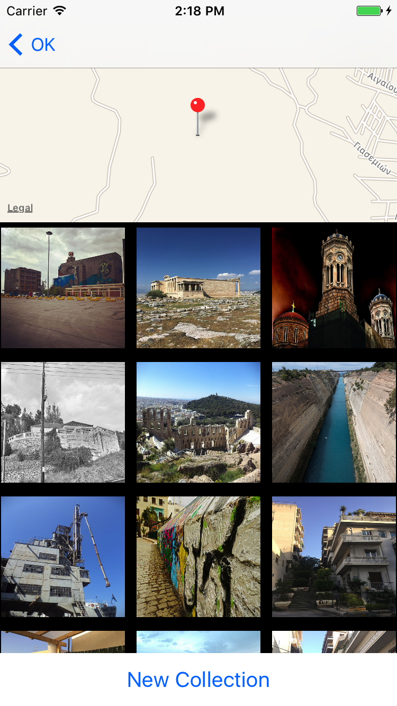
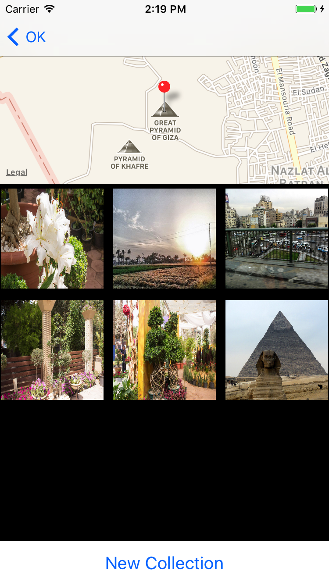
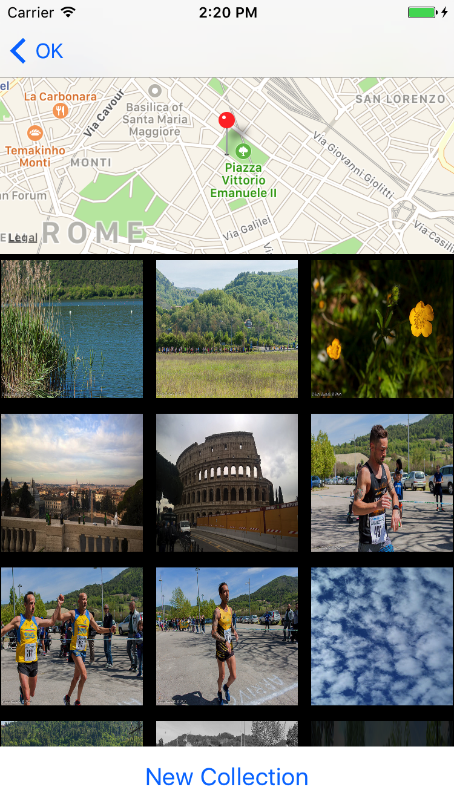
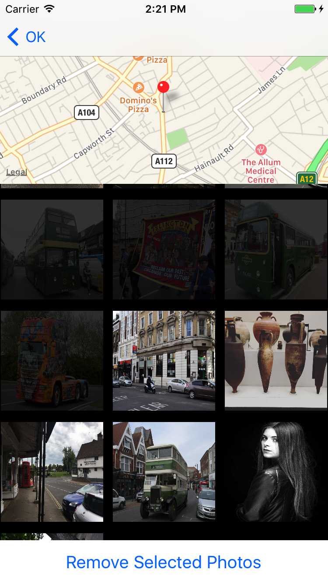

# Virtual Tourist
Using this app, you can tour the world without leaving the comforts of your couch. This app allows you to drop pins on a map and pull up public Flickr images associated with that location.

## Overview
The app starts with a map view where you can drop a pin to download some of the public Flickr photos at that location. The pin locations and the photos are stored using Core Data, and you can delete them by tapping the edit button.

You can then tap on the pin to start downloading the photos. You can also choose to download another set, or to remove some of them and keep the others. There's also an option on the homepage (the map view) so that the photos start downloading as soon as you drop the pin.

## Setup
In order to use/test this app, you'll need to have a Flickr API key (you can temporarily use mine: "b5bd983bdb0a963a5953c60c3bb9ec70"). You need to change it in the FlikrConstants.swift file:
```swift
// MARK: Flikr API key
static let API_KEY: String = "ENTER_A_FLIKR_API_KEY"
```

## Screenshots
       

## License
See [LICENSE](LICENSE)
